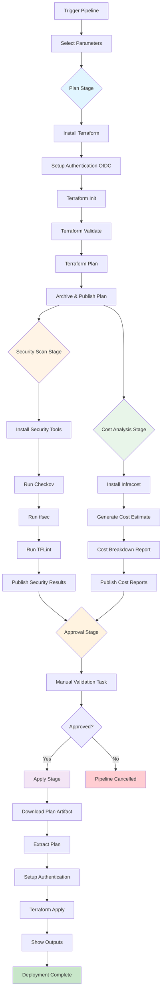

# Pipeline Flow Diagram

## Complete Pipeline Flow (All Features Enabled)



## Stage Details

### 1. Plan Stage
**Purpose**: Generate Terraform execution plan
- Authenticates to Azure using OIDC
- Initializes Terraform with remote state
- Validates configuration
- Creates detailed execution plan
- Saves plan as artifact

**Duration**: ~2-3 minutes

### 2. Security Scan Stage (Optional)
**Purpose**: Identify security vulnerabilities and misconfigurations
- Runs in parallel with Cost Analysis
- Scans against 1000+ security rules
- Checks compliance (CIS, PCI-DSS, etc.)
- Publishes results as test results

**Tools**:
- **Checkov**: Comprehensive IaC scanner
- **tfsec**: Terraform-specific checks
- **TFLint**: Best practices and errors

**Duration**: ~1-2 minutes

**Can Fail Pipeline**: Configurable via parameter

### 3. Cost Analysis Stage (Optional)
**Purpose**: Estimate infrastructure costs before deployment
- Runs in parallel with Security Scan
- Calculates monthly costs
- Breaks down by resource
- Generates multiple report formats

**Tool**: Infracost

**Duration**: ~1 minute

**Outputs**:
- Console cost breakdown
- HTML interactive report
- JSON for automation
- Text report

### 4. Approval Stage
**Purpose**: Manual review and approval gate
- Waits for human approval
- Blocks until approved/rejected
- Timeout: Configurable (default: reject)

**Review Items**:
- ✅ Terraform plan changes
- ✅ Security scan findings
- ✅ Cost estimates
- ✅ Environment validation

**Duration**: Variable (human-dependent)

### 5. Apply Stage
**Purpose**: Execute approved Terraform changes
- Downloads saved plan artifact
- Re-authenticates to Azure
- Applies exact plan (no drift)
- Shows deployment outputs

**Duration**: ~3-10 minutes (depends on changes)

## Pipeline Conditions

### When Security Scan Runs
```yaml
condition: and(succeeded(), eq('runSecurityScan', 'true'))
```

### When Cost Analysis Runs
```yaml
condition: and(succeeded(), eq('runCostAnalysis', 'true'))
```

### When Approval Runs
```yaml
condition: and(
  eq(Plan.result, 'Succeeded'),
  eq(Plan.hasChanges, 'true'),
  in(SecurityScan.result, 'Succeeded', 'Skipped'),
  in(CostAnalysis.result, 'Succeeded', 'Skipped')
)
```

### When Apply Runs
```yaml
condition: succeeded()  # Only after approval
```

## Parallel Execution

The pipeline optimizes execution time by running stages in parallel where possible:

```
Plan Stage (Sequential)
    ↓
    ├─→ Security Scan (Parallel) ──┐
    │                               ├─→ Approval Stage
    └─→ Cost Analysis (Parallel) ──┘
                                   ↓
                            Apply Stage (Sequential)
```

**Time Savings**: ~1-2 minutes by running scans in parallel

## Failure Scenarios

### Plan Fails
- Pipeline stops immediately
- Security and Cost Analysis do not run
- Review Terraform errors in logs

### Security Scan Fails
- **If** `failOnSecurityIssues = false`: Warning only, continues
- **If** `failOnSecurityIssues = true`: Pipeline fails, stops before approval
- Review security findings in test results

### Cost Analysis Fails
- Non-blocking failure
- Pipeline continues with warning
- Check logs for Infracost errors

### Approval Rejected
- Pipeline cancelled
- No changes applied
- Can re-run pipeline after fixes

### Apply Fails
- Infrastructure may be partially created
- Review Terraform state
- Fix issues and re-run
- May need manual intervention

## Quick Reference

| Stage | Optional | Parallel | Duration | Can Fail Pipeline |
|-------|----------|----------|----------|-------------------|
| Plan | No | No | 2-3 min | Yes |
| Security Scan | Yes | Yes | 1-2 min | Configurable |
| Cost Analysis | Yes | Yes | 1 min | No |
| Approval | No* | No | Variable | Yes (reject) |
| Apply | No | No | 3-10 min | Yes |

\* Approval only runs if there are changes to apply

## Minimal Pipeline (All Optional Features Disabled)

```
Plan → Approval → Apply
```

**Total Duration**: ~5-13 minutes

## Full Pipeline (All Features Enabled)

```
Plan → [Security Scan + Cost Analysis] → Approval → Apply
```

**Total Duration**: ~7-16 minutes

## Tips for Faster Pipelines

1. **Disable for dev**: Skip security/cost for quick dev iterations
2. **Use caching**: Terraform providers are cached between runs
3. **Parallel stages**: Security and Cost run simultaneously
4. **Small changes**: Incremental changes deploy faster
5. **Pre-validate**: Run `terraform validate` locally first

## Environment-Specific Recommendations

### Development
```yaml
runSecurityScan: false      # Optional for dev
runCostAnalysis: false      # Optional for dev
failOnSecurityIssues: false
```

### QA
```yaml
runSecurityScan: true       # Catch issues before prod
runCostAnalysis: true       # Verify costs reasonable
failOnSecurityIssues: false # Warning only
```

### Production
```yaml
runSecurityScan: true       # Always scan prod
runCostAnalysis: true       # Monitor prod costs
failOnSecurityIssues: true  # Block insecure deployments
```

## Monitoring and Observability

### Artifacts Generated
- `terraform-plan` - Terraform plan file and working directory
- `cost-analysis-{env}` - Cost reports (txt, html, json)
- Security scan results (published as test results)

### Logs Available
- Plan output with resource changes
- Security scan detailed findings
- Cost breakdown by resource
- Apply operation results

### Notifications
Configure Azure DevOps notifications for:
- Pipeline failures
- Approval required
- Security issues found
- Cost threshold exceeded

