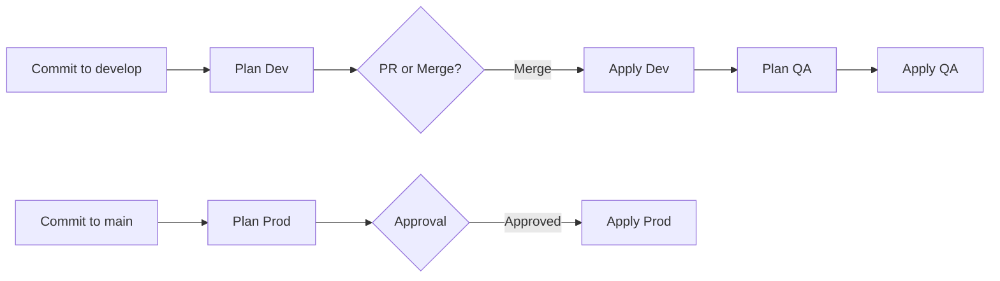

# Azure DevOps Pipelines - Terraform Infrastructure Deployment

This directory contains Azure DevOps pipeline definitions for deploying the EVO-TASKERS infrastructure using Terraform with industry best practices.

## 📋 Table of Contents

- [Overview](#overview)
- [Architecture](#architecture)
- [Prerequisites](#prerequisites)
- [Quick Start](#quick-start)
- [Pipeline Structure](#pipeline-structure)
- [Deployment Flow](#deployment-flow)
- [Security & Best Practices](#security--best-practices)
- [Troubleshooting](#troubleshooting)

## 🎯 Overview

This solution provides:

- **Multi-stage pipelines** with plan and apply stages
- **Environment promotion** from Dev → QA → Prod
- **Automated security scanning** with Checkov
- **State management** with Azure Storage backend
- **Approval gates** for production deployments
- **Reusable templates** for consistency
- **No hardcoded credentials** - all via service connections and variable groups

## 🏗️ Architecture

### Deployment Layers

```
┌─────────────────────────────────────────────────┐
│  Layer 1: Landing Zone / Common Infrastructure  │
│  - VNet, Subnets, NSGs                          │
│  - Key Vault, Storage Account                   │
│  - Log Analytics, App Insights                  │
│  - Bastion (optional)                           │
└─────────────────────────────────────────────────┘
                      ↓
┌─────────────────────────────────────────────────┐
│  Layer 2: Application Workloads                 │
│  - Windows Function Apps                        │
│  - Linux Web Apps                               │
│  - Application-specific resources               │
└─────────────────────────────────────────────────┘
```

### Environment Strategy

```
Developer → develop branch → Dev Environment
                ↓
            Auto-deploy to QA
                ↓
           main branch → Production (with approval)
```

## 📋 Prerequisites

### 1. Azure Resources

- [ ] Azure subscriptions for Dev, QA, and Prod (or resource groups)
- [ ] Storage account and container for Terraform state
- [ ] Service principals with appropriate permissions

### 2. Azure DevOps Setup

- [ ] Azure DevOps organization and project
- [ ] Service connections configured for each environment
- [ ] Variable groups created
- [ ] Environments configured with approvals

### 3. Required Tools (for local testing)

```bash
# Install Terraform
brew install terraform

# Install Azure CLI
brew install azure-cli

# Install Azure DevOps CLI extension
az extension add --name azure-devops
```

## 🚀 Quick Start

### Step 1: Set Up Backend Storage

Run the backend setup script to create Terraform state storage:

```bash
cd backend-setup-scripts
chmod +x setup-terraform-state.sh
./setup-terraform-state.sh
```

Or manually:

```bash
az group create --name rg-terraform-state --location "West US 2"
az storage account create \
  --name stterraformstate$(date +%s) \
  --resource-group rg-terraform-state \
  --location "West US 2" \
  --sku Standard_LRS
```

### Step 2: Create Service Connections

Follow the guide: [pipelines/setup/create-service-connections.md](./setup/create-service-connections.md)

1. Navigate to Project Settings → Service connections
2. Create service connections for Dev, QA, and Prod
3. Note the names for variable groups

### Step 3: Create Variable Groups

Run the automated script:

```bash
cd pipelines/setup
chmod +x create-variable-groups.sh
# Edit the script first to set your organization and project
./create-variable-groups.sh
```

Or manually create in Azure DevOps UI (see [VARIABLE-GROUPS.md](./setup/VARIABLE-GROUPS.md))

### Step 4: Configure Environments

1. Navigate to **Pipelines** → **Environments**
2. Create environments:
   - `evo-taskers-dev`
   - `evo-taskers-qa`
   - `evo-taskers-prod`
   - `evo-taskers-automateddatafeed-dev`
   - `evo-taskers-automateddatafeed-qa`
   - `evo-taskers-automateddatafeed-prod`
   - (Similar for each application)

3. Configure approvals for production environments:
   - Select a prod environment
   - Click **Approvals and checks**
   - Add **Approvals**
   - Add approvers
   - Configure timeout and instructions

### Step 5: Create Pipelines

#### Landing Zone Pipeline

1. Navigate to **Pipelines** → **New pipeline**
2. Select **Azure Repos Git** (or your source)
3. Select your repository
4. Choose **Existing Azure Pipelines YAML file**
5. Select `/pipelines/landing-zone-pipeline.yml`
6. Click **Run**

#### Applications Pipeline

Repeat the process with `/pipelines/applications-pipeline.yml`

### Step 6: Fix Backend Configurations

The existing backend.tf files have hardcoded subscription IDs. Update them to use environment variables:

```bash
# Option 1: Manual update
# Remove subscription_id from provider blocks in backend.tf files
# The service connection will provide this via ARM_SUBSCRIPTION_ID

# Option 2: Use the provided template
# Copy backend-config/provider.tf.template to each module's backend.tf
# and customize the backend configuration section
```

## 📁 Pipeline Structure

```
pipelines/
├── README.md                           # This file
├── landing-zone-pipeline.yml           # Common infrastructure pipeline
├── applications-pipeline.yml           # Application workloads pipeline
├── templates/
│   └── terraform-template.yml          # Reusable Terraform steps template
├── setup/
│   ├── create-variable-groups.sh       # Variable groups creation script
│   ├── create-service-connections.md   # Service connections guide
│   └── VARIABLE-GROUPS.md              # Variable groups documentation
└── examples/
    ├── single-app-pipeline.yml         # Example: Deploy single app
    └── destroy-pipeline.yml            # Example: Destroy resources
```

## 🔄 Deployment Flow

### Landing Zone Pipeline



### Application Pipeline

Each application follows the same pattern:

```yaml
Dev (develop branch)
  → Plan Dev
  → Apply Dev (auto)
  → Plan QA
  → Apply QA (auto)

Prod (main branch)
  → Plan Prod
  → Apply Prod (requires approval)
```

### Stage Dependencies

```
Landing Zone (common)
        ↓
Application Workloads
        ↓
   (Deploy in any order)
```

## 🎛️ Pipeline Features

### 1. Automated Planning

Every commit triggers a plan:
- PRs: Plan only (no apply)
- Merges: Plan + Apply

### 2. Security Scanning

Checkov scans every plan for:
- Security misconfigurations
- Compliance violations
- Best practice violations

Results published as test results in pipeline.

### 3. State Locking

Azure Storage backend provides automatic state locking:
- Prevents concurrent modifications
- Protects against corruption
- Enables team collaboration

### 4. Workspace Management

Applications use Terraform workspaces for environment isolation:
- `dev` workspace for development
- `qa` workspace for QA
- `prod` workspace for production

Landing zone uses separate state files per environment.

### 5. Artifact Publishing

Each pipeline publishes:
- Terraform plan files
- Terraform outputs (JSON)
- Security scan results

### 6. Approval Gates

Production deployments require:
- Manual approval
- Optional: Branch policies
- Optional: Security checks

## 🔒 Security & Best Practices

### 1. No Hardcoded Credentials

✅ **Correct**:
```yaml
- task: AzureCLI@2
  inputs:
    azureSubscription: '$(DEV_SERVICE_CONNECTION)'
```

❌ **Incorrect**:
```yaml
subscription_id = "b2c30590-db17-4740-b3c6-6853aab1d9a2"
```

### 2. Service Principal Least Privilege

Grant only required permissions:
- **Contributor**: For resource deployment
- **User Access Administrator**: Only if managing RBAC

### 3. State File Security

Backend storage account configuration:
- ✅ HTTPS only
- ✅ TLS 1.2 minimum
- ✅ No public access
- ✅ Versioning enabled
- ✅ Soft delete enabled (30 days)
- ✅ Private endpoints (optional)

### 4. Branch Protection

Configure branch policies on `main`:
```
Required:
- Pull request before merge
- Minimum 1 reviewer
- Work item linking
- Build validation (run plan)
```

### 5. Environment Protection

Production environments should have:
- Required approvers (2+ recommended)
- Timeout (30 minutes default)
- Notification to approvers

### 6. Secret Management

Never store secrets in:
- ❌ Variable groups (plain text)
- ❌ YAML files
- ❌ tfvars files

Always use:
- ✅ Azure Key Vault
- ✅ Service connections
- ✅ Managed identities

### 7. Audit and Compliance

Enable:
- Azure DevOps audit logs
- Azure Activity logs
- Terraform state history
- Security scan results

## 📊 Monitoring & Alerts

### Pipeline Monitoring

Monitor pipeline runs:
```bash
# List recent pipeline runs
az pipelines runs list \
  --pipeline-ids <id> \
  --top 10 \
  --output table

# Show specific run details
az pipelines runs show --id <run-id>
```

### Recommended Alerts

Configure alerts for:
- Failed pipeline runs
- Security scan failures
- Unapproved production changes
- State file modifications

## 🔧 Common Operations

### Running a Pipeline Manually

```bash
# Run landing zone pipeline for dev
az pipelines run \
  --name "landing-zone-pipeline" \
  --branch develop

# Run with specific parameters
az pipelines run \
  --name "applications-pipeline" \
  --branch main \
  --parameters deployAutomatedDataFeed=true
```

### Viewing Pipeline Logs

```bash
# Download logs from a pipeline run
az pipelines runs show \
  --id <run-id> \
  --open

# Download artifacts
az pipelines runs artifact download \
  --run-id <run-id> \
  --artifact-name tfplan-dev \
  --path ./downloads
```

### Canceling a Running Pipeline

```bash
az pipelines build cancel --id <build-id>
```

## 🐛 Troubleshooting

### Issue: Pipeline fails at Init

**Error**: `Error: Failed to get existing workspaces`

**Solution**:
1. Verify backend storage account exists
2. Check service connection has access
3. Verify variable group values are correct

```bash
# Verify storage account
az storage account show \
  --name $(BACKEND_STORAGE_ACCOUNT_NAME) \
  --resource-group $(BACKEND_RESOURCE_GROUP_NAME)

# Check container exists
az storage container show \
  --name $(BACKEND_CONTAINER_NAME) \
  --account-name $(BACKEND_STORAGE_ACCOUNT_NAME)
```

### Issue: Service Connection Not Found

**Error**: `Service connection 'Azure-Dev-ServiceConnection' could not be found`

**Solution**:
1. Verify service connection name in Azure DevOps
2. Check variable group has correct name
3. Ensure pipeline has permission to use service connection

### Issue: Approval Timeout

**Error**: `The deployment was not approved`

**Solution**:
1. Increase timeout in environment settings
2. Notify approvers
3. Check approval permissions

### Issue: State Lock

**Error**: `Error: Error acquiring the state lock`

**Solution**:
```bash
# List locks (from local with Azure CLI)
az storage blob lease list \
  --container-name tfstate \
  --account-name <storage-account>

# If stuck, force unlock (use carefully!)
terraform force-unlock <lock-id>
```

### Issue: Terraform Plan Shows Unexpected Changes

**Potential causes**:
1. Drift - resources modified outside Terraform
2. Wrong workspace selected
3. Variables changed

**Solution**:
```bash
# Check workspace
terraform workspace show

# Refresh state
terraform refresh

# Show state
terraform show
```

### Issue: Security Scan Fails

**Error**: Checkov findings

**Solution**:
1. Review findings in test results
2. Fix security issues in Terraform code
3. If false positive, add skip annotation:

```hcl
resource "azurerm_storage_account" "example" {
  #checkov:skip=CKV_AZURE_XXX:Reason for skip
  name = "mystorageaccount"
}
```

## 📚 Additional Resources

### Terraform Documentation
- [Terraform Azure Provider](https://registry.terraform.io/providers/hashicorp/azurerm/latest/docs)
- [Terraform Workspaces](https://www.terraform.io/docs/language/state/workspaces.html)
- [Backend Configuration](https://www.terraform.io/docs/language/settings/backends/azurerm.html)

### Azure DevOps Documentation
- [Azure Pipelines YAML](https://docs.microsoft.com/en-us/azure/devops/pipelines/yaml-schema)
- [Service Connections](https://docs.microsoft.com/en-us/azure/devops/pipelines/library/service-endpoints)
- [Variable Groups](https://docs.microsoft.com/en-us/azure/devops/pipelines/library/variable-groups)
- [Environments](https://docs.microsoft.com/en-us/azure/devops/pipelines/process/environments)

### Best Practices Guides
- [Terraform Best Practices](https://www.terraform-best-practices.com/)
- [Azure Landing Zones](https://docs.microsoft.com/en-us/azure/cloud-adoption-framework/ready/landing-zone/)
- [Checkov Documentation](https://www.checkov.io/)

## 🤝 Contributing

### Making Changes to Pipelines

1. Create a feature branch
2. Make changes to YAML files
3. Test locally if possible
4. Create pull request
5. Review changes
6. Merge to develop for testing
7. Promote to main for production

### Pipeline Versioning

Tag pipeline versions for tracking:

```bash
git tag -a pipelines/v1.0.0 -m "Initial pipeline release"
git push origin pipelines/v1.0.0
```

### Testing Changes

Before merging pipeline changes:

1. ✅ Validate YAML syntax
2. ✅ Test with dev environment
3. ✅ Review plan output
4. ✅ Check security scan results
5. ✅ Verify approvals work

## 📝 Changelog

### Version 1.0.0 (Initial Release)

**Features**:
- Multi-stage pipelines for landing zone and applications
- Environment promotion (Dev → QA → Prod)
- Terraform workspace support
- Security scanning with Checkov
- Reusable templates
- Comprehensive documentation

**Security**:
- No hardcoded credentials
- Service connection-based authentication
- State file encryption
- Approval gates for production

## 📞 Support

For issues or questions:

1. Check [Troubleshooting](#troubleshooting) section
2. Review [Azure DevOps documentation](https://docs.microsoft.com/en-us/azure/devops/)
3. Check Terraform state and logs
4. Contact DevOps team

## 📄 License

Internal use only - EVO TASKERS project

